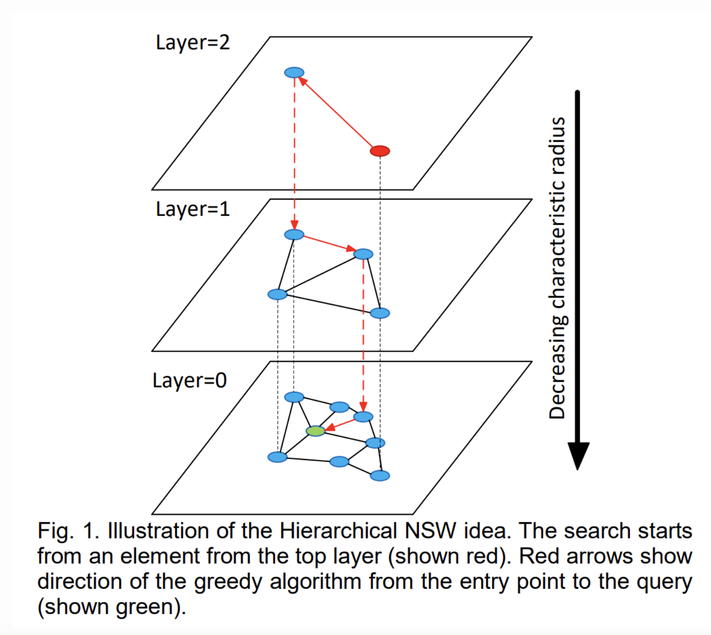
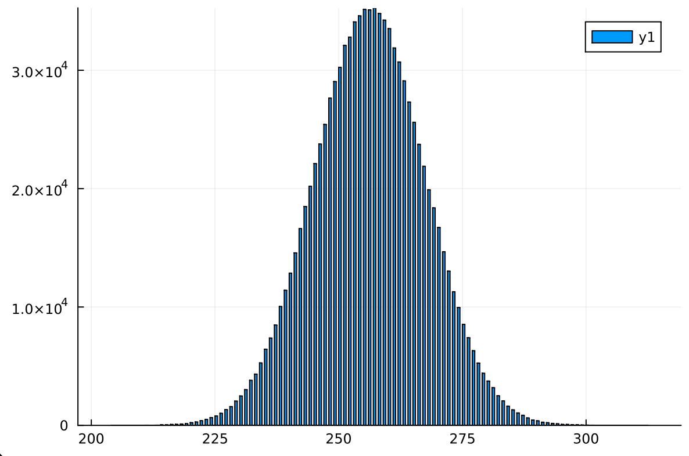

# Approximate Search

> There was a bug in the min heap implementation which caused the search to be far less exhaustive. The timings are much higher than before but the accuracy is much better.

> [code](https://github.com/domluna/tinyrag/blob/main/hnsw/hnsw.jl)

## Prior Work

[paper](https://arxiv.org/abs/1603.09320)

In the last post I focused on exact search, and it doing so managed to get 1ms search time for 1M records of [64 bytes](https://www.mixedbread.ai/blog/binary-mrl). This was done by representing the 64 bytes as a static vector of 8 UInt64 elements which generates a single SIMD512 operation:

```
;  @ /Users/lunaticd/code/tiny-binary-rag/hnsw.jl:31 within `hamming_distance`
define i64 @julia_hamming_distance_22505(ptr nocapture noundef nonnull readonly align 8 dereferenceable(64) %"x1::SArray", ptr nocapture noundef nonnull readonly align 8 dereferenceable(64) %"x2::SArray") #0 {
top:
;  @ /Users/lunaticd/code/tiny-binary-rag/hnsw.jl:36 within `hamming_distance`
; ┌ @ simdloop.jl:77 within `macro expansion` @ /Users/lunaticd/code/tiny-binary-rag/hnsw.jl:37
; │┌ @ /Users/lunaticd/code/tiny-binary-rag/hnsw.jl:28 within `hamming_distance`
; ││┌ @ int.jl:373 within `xor`
     %0 = load <8 x i64>, ptr %"x1::SArray", align 8
     %1 = load <8 x i64>, ptr %"x2::SArray", align 8
     %2 = xor <8 x i64> %1, %0
; ││└
; ││┌ @ int.jl:415 within `count_ones`
     %3 = call <8 x i64> @llvm.ctpop.v8i64(<8 x i64> %2)
; │└└
; │┌ @ int.jl:87 within `+`
    %4 = call i64 @llvm.vector.reduce.add.v8i64(<8 x i64> %3)
; └└
;  @ /Users/lunaticd/code/tiny-binary-rag/hnsw.jl:39 within `hamming_distance`
  ret i64 %4
}
```

This is reflected in the timings:

```julia
julia> q1 = SVector{8, UInt64}(rand(UInt64,8));

julia> q2 = SVector{8, UInt64}(rand(UInt64,8));

julia> @be hamming_distance($q1, $q2)
Benchmark: 5034 samples with 7334 evaluations
min    2.483 ns
median 2.505 ns
mean   2.583 ns
max    5.892 ns
```

And so comparing the distance of the query vector to 1M rows would take around 2.5ms. And this is roughly what we managed, with some overhead of keeping the k-closest neighbors.

```julia
julia> @be k_closest($X1, $q1, 100)
Benchmark: 28 samples with 1 evaluation
min    3.207 ms (5 allocs: 3.281 KiB)
median 3.433 ms (5 allocs: 3.281 KiB)
mean   3.562 ms (5 allocs: 3.281 KiB)
max    4.749 ms (5 allocs: 3.281 KiB)
```

And if parallelized over 4 cores:

```julia
julia> @be k_closest_parallel($X1, $q1, 100)
Benchmark: 83 samples with 1 evaluation
min    1.099 ms (58 allocs: 23.906 KiB)
median 1.117 ms (58 allocs: 23.906 KiB)
mean   1.180 ms (58 allocs: 23.906 KiB)
max    2.570 ms (58 allocs: 23.906 KiB)
```

This is very, very fast and would already not be the bottleneck in a RAG architecture, but it scales linearly, so 100M rows would take 100ms, etc.

This is where approximate search comes in, which sacrifices accuracy for runtime.

## HNSW (Hierarchical Navigable Small World)

My motivation was to determine whether I could get this to ~1 microsecond for 1M rows. A 1000 fold increase on the exact search.

We are going to use HNSW for the approximate search. It's approximate because small subset of the available nodes are searched.

Here is how it works:

### Creation

> All nodes are 64 bytes (UInt64 * 8).

The HNSW is a series of graphs, where each graph is known as a layer. The first (bottom) layer will have every node inserted. Each layer after that will have a logarithmically smaller number of nodes. This is what it looks like with 100, 1000, and 10000 nodes.

```
julia> hnsw = construct(100; connectivity=16);
Layer 1: length = 100
Layer 2: length = 13

julia> hnsw = construct(1000; connectivity=16);
Layer 1: length = 1000
Layer 2: length = 164
Layer 3: length = 9

julia> hnsw = construct(10000; connectivity=16);
Layer 1: length = 10000
Layer 2: length = 1180
Layer 3: length = 90
Layer 4: length = 2
```

What is connectivity? In the original paper this is `M`.

This is maximum number of edges a node can have. In the paper this is doubled for the bottom layer, we do this as well, Meaning each node in the bottom layer has 32 edges instead of 16. The edges kept is determined by distance, meaning the 16 edges point to the 16 nodes closest the central node discovered during the search.

The paper recommends setting this value anywhere from 5 to 48 depending on the dimensionality of the data, higher dimensions requires a higher M but it also means a higher construction and search time.



### Search

So we want to find the k closest nodes to the query node. What do we do?

Start at the top layer and find the node closest to the query node. This is the new "enter point". Keep doing this for each layer using the enter point as the node which the search begins.

This is the entire code:


```julia
function search(hnsw::HNSW, query::SVector{8,UInt64}, k::Int; expansion_search::Int=30, maximum_candidates=1000)::Vector{Int}
    candidates = MinHeap(maximum_candidates)
    W = MaxHeap(1)
    if k > expansion_search
        expansion_search = k
    end

    L = length(hnsw.graphs)
    ep = hnsw.enter_point
    for level = L:-1:2
        ep = _search_layer(hnsw, candidates, W, query, ep, level)[1]
        reset!(candidates)
        reset!(W)
    end
    W = MaxHeap(expansion_search)
    result = _search_layer(hnsw, candidates, W, query, ep, 1)
    n = min(k, length(W))
    return result[1:n]
end
```

Until we get the first layer, the max-heap is kept to a size of 1, as a way to minimize the search in the layer.

The algorithm is designed in a way so that the main search is done at the bottom layer, and the searches prior to that are done so that we start the search at the best position.

However, it might be beneficial to set to a higher value than 1, especially if we have a large number of nodes, consider a 1M node graph. The layer structure would look something like this

```
Layer 1: length = 1000000
Layer 2: length = 74925
Layer 3: length = 7795
Layer 4: length = 510
Layer 5: length = 28
Layer 6: length = 2
```

the 2nd and 3rd layers have the order of ~100,000 and ~10,000 nodes, so doing slightly more exhaustive search might be a worthwhile.

Again, and this THE recurring theme with approximate search, everything we do is a tradeoff between accuracy and runtime.

## 1μs

Assuming we only need to do distance comparisons and each comparison is 2.5ns, we could afford ~400 comparisons. Unfortunately, there's more work than just distance comparisons.

Everytime a comparison is done there's 30-50ns of total work being performed which means only 20-30 comparisons can be done if the benchmark needs to be hit.

This is a sample search

```
julia> search(hnsw, q, 30; expansion_search=30, maximum_candidates=64)
┌ Info:
│   level = 6
└   length(visited) = 1
┌ Info:
│   level = 5
└   length(visited) = 1
┌ Info:
│   level = 4
└   length(visited) = 1
┌ Info:
│   level = 3
└   length(visited) = 1
┌ Info:
│   level = 2
└   length(visited) = 32
┌ Info:
│   level = 1
└   length(visited) = 706
30-element Vector{Int64}:
```

Before the last layer we would be over the budget number of comparisons.

```
julia> @be search($hnsw, $q, 30; expansion_search=30, maximum_candidates=64)
Benchmark: 3076 samples with 1 evaluation
min    19.083 μs (80 allocs: 54.422 KiB)
median 21.750 μs (80 allocs: 54.422 KiB)
mean   30.752 μs (80 allocs: 54.422 KiB, 0.10% gc time)
max    12.444 ms (80 allocs: 54.422 KiB, 99.46% gc time)
```

Most of the allocation, oddly enough, happens when adding elements to the visited set, everything else is in-place.

In the above case it searched over 631 nodes so this took 21,750 / 631 = ~35ns for each node. Meaning we can search at most 28 nodes. To see how actionable this let's go to the extreme case

```julia
julia> search(hnsw, q, 1; expansion_search=1, maximum_candidates=1)
┌ Info:
│   level = 6
└   length(visited) = 1
┌ Info:
│   level = 5
└   length(visited) = 1
┌ Info:
│   level = 4
└   length(visited) = 1
┌ Info:
│   level = 3
└   length(visited) = 1
┌ Info:
│   level = 2
└   length(visited) = 17
┌ Info:
│   level = 1
└   length(visited) = 27
```

Even in this case we're still searching 48 nodes!

```julia
julia> @be search($hnsw, $q, 1; expansion_search=1, maximum_candidates=1)
Benchmark: 4131 samples with 8 evaluations
min    1.906 μs (65 allocs: 4.328 KiB)
median 2.198 μs (65 allocs: 4.328 KiB)
mean   2.746 μs (65 allocs: 4.328 KiB, 0.02% gc time)
max    1.510 ms (65 allocs: 4.328 KiB, 99.53% gc time)
```

The timing will not scale perfectly linearly with the number of nodes searched because there is overhead that would be there even if we searched 0 nodes.

To simulate this let's break out of the search loop immediately on for each layer:

```julia
julia> @be search($hnsw, $q, 1; expansion_search=1, maximum_candidates=1)
Benchmark: 2281 samples with 30 evaluations
min    854.167 ns (59 allocs: 3.016 KiB)
median 915.267 ns (59 allocs: 3.016 KiB)
mean   1.354 μs (59 allocs: 3.016 KiB, 0.09% gc time)
max    436.075 μs (59 allocs: 3.016 KiB, 99.52% gc time)
```

About 60% of this timing is dealing with the visited set so perhaps if that was more efficientthen maybe 1 microsecond would be practical for very small `k`.

```julia
julia> @be search($hnsw, $q, 5; expansion_search=5, maximum_candidates=5)
Benchmark: 4162 samples with 15 evaluations
min    1.161 μs (20 allocs: 1.609 KiB)
median 1.308 μs (20 allocs: 1.609 KiB)
mean   1.574 μs (20 allocs: 1.609 KiB, 0.02% gc time)
max    781.181 μs (20 allocs: 1.609 KiB, 99.43% gc time)
```

Nonetheless, it's very unlikely one would be satisfied with the accuracy:

```julia
julia> approx_vs_exact(hnsw, 5; expansion_search=5, maximum_candidates=5)
HNSW inds [507686, 595898, 757296, 863989, 913515]
Manual inds [60492, 513115, 783358, 933691, 948184]
HNSW distances [246, 246, 246, 247, 248]
Manual distances [203, 203, 204, 205, 208]

julia> approx_vs_exact(hnsw, 5; expansion_search=5, maximum_candidates=64)
HNSW inds [222216, 258762, 291972, 491148, 913515]
Manual inds [324624, 410272, 500930, 854572, 892412]
HNSW distances [220, 226, 229, 230, 231]
Manual distances [197, 200, 202, 203, 204]

julia> approx_vs_exact(hnsw, 5; expansion_search=64, maximum_candidates=64)
HNSW inds [54599, 114243, 507686, 851249, 908946]
Manual inds [270887, 400774, 432766, 779920, 802845]
HNSW distances [217, 221, 226, 226, 227]
Manual distances [200, 205, 205, 205, 205]

julia> @be search($hnsw, $q, 5; expansion_search=5, maximum_candidates=64)
Benchmark: 4167 samples with 2 evaluations
min    6.708 μs (73 allocs: 16.938 KiB)
median 8.312 μs (73 allocs: 16.938 KiB)
mean   11.223 μs (73 allocs: 16.938 KiB, 0.05% gc time)
max    5.792 ms (73 allocs: 16.938 KiB, 99.44% gc time)

julia> @be search($hnsw, $q, 5; expansion_search=64, maximum_candidates=64)
Benchmark: 2679 samples with 1 evaluation
min    24.000 μs (80 allocs: 55.547 KiB)
median 27.333 μs (80 allocs: 55.547 KiB)
mean   35.262 μs (80 allocs: 55.547 KiB, 0.07% gc time)
max    9.395 ms (80 allocs: 55.547 KiB, 99.25% gc time)
```

With <= 30us, you can get a much better results.

Lastly, the timings be similar for 100M and 1B rows as well, 1000 vs 1M entries the timings are basically the same.

## Distance Distribution

I've found the results to degrade the more entries you add. Close vectors are still found, but after enough entries it's rare to find the "closest" ones. I believe this is because the distances are so similar.

```julia
julia> q = SVector{8,UInt64}(reinterpret(UInt64, rand(Int8, 64)));

julia> distances = [hamming_distance(q, hnsw.data[i]) for i in 1:length(hnsw.data)];

julia> sort!(distances);

julia> minimum(distances)
204

julia> maximum(distances)
312
```

Let's create a bar chart:



This is a normal distribution, which is not good for approximate search since the values we want the most are in the very tail end of the distribution, and it's very unlikely we'll be dropped there. However, we do still find values in the tail end which is not bad.

This can be problematic as well when it comes to the search routine, where it can become detrimental to add more nodes:

```julia
julia> approx_vs_exact(hnsw, q, 5, 32, 250)
HNSW inds [13646, 49478, 517963, 698511, 745440]
Manual inds [7663, 248927, 798551, 873174, 981022]
HNSW distances [216, 219, 220, 220, 221]
Manual distances [204, 205, 205, 206, 207]

julia> approx_vs_exact(hnsw, q, 5, 64, 250)
HNSW inds [38969, 126823, 514271, 564230, 639966]
Manual inds [7663, 248927, 798551, 873174, 981022]
HNSW distances [219, 220, 220, 221, 222]
Manual distances [204, 205, 205, 206, 207]
```

The more exhaustive search produces a worse result! Why?

If we track down where the search diverges it's when node 23629 is taken instead of node 455479. Both these nodes have a distance to the query node of 234. Taking one path over another can lead to a worse local optimum.

In a real world setting the distribution might not be a bell shaped in which case this wouldn't be as much of a issue.

It's interesting nonetheless to see how the distribution of data can guarantee approximate search will have suboptimal results.
